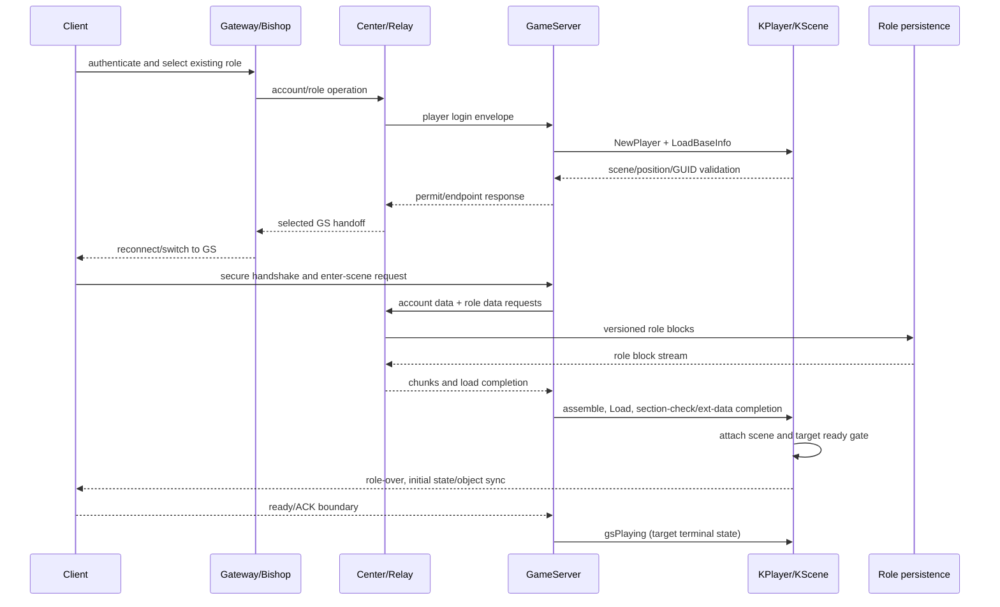
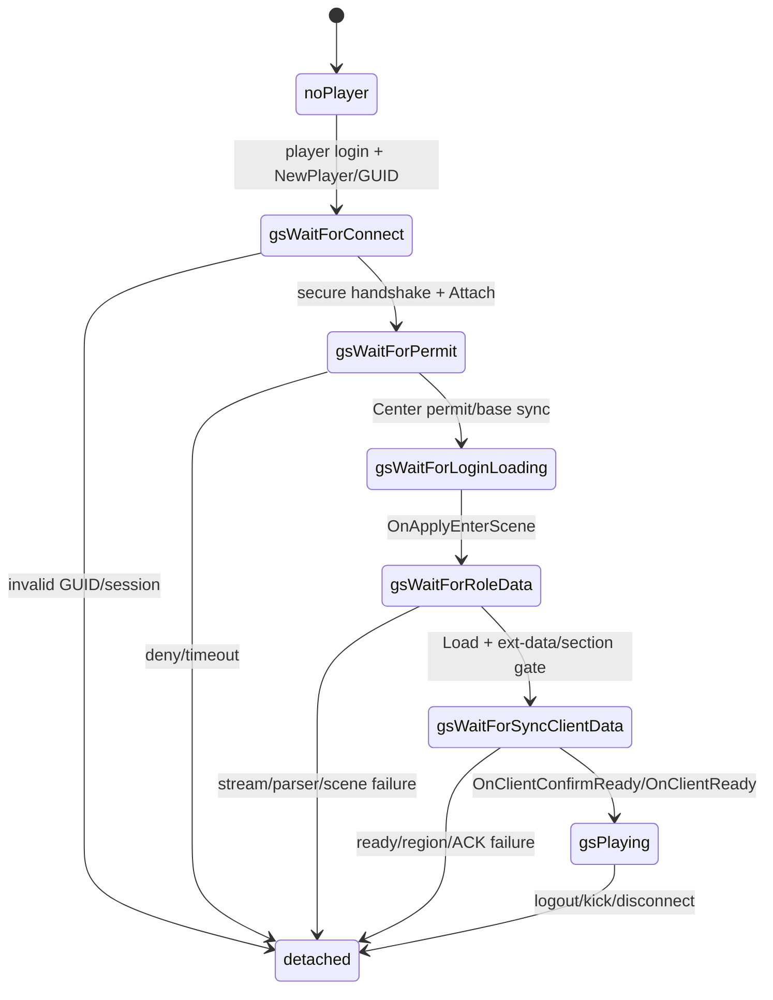
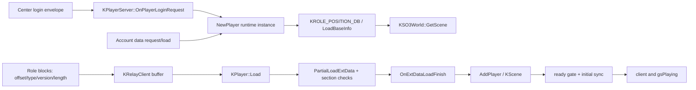
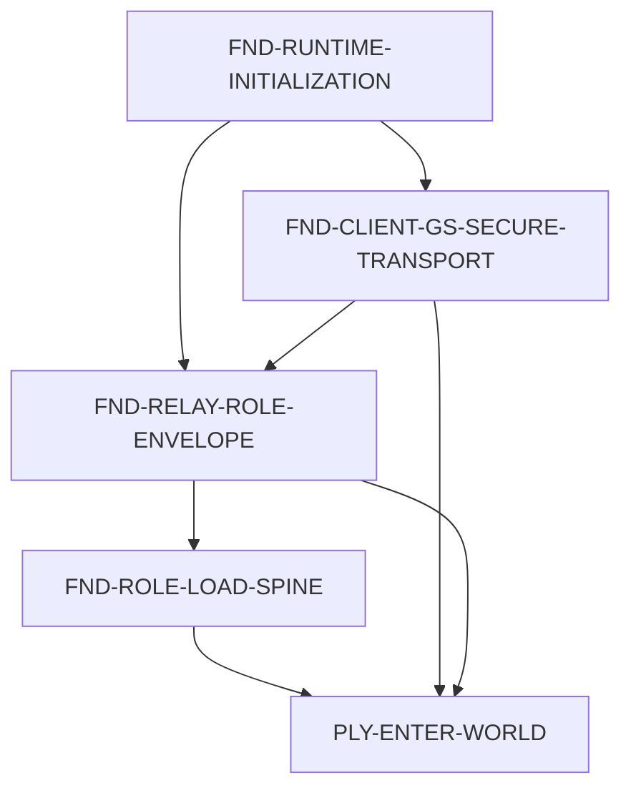

# Wave 1 Atlas — Foundations and Entry

This is the architecture picture for the first visible journey: boot the
GameServer, admit an existing role, load its persisted data, attach it to a
scene, and reach the target ready/initial-synchronisation boundary. It is a
map for humans and agents; detailed GraphEngine relations and packet ledgers
remain in the linked dossiers.

## 1. Scope and success boundary

The wave covers the contracts required to take one reproducible existing role
from a valid server boot to a target-backed scene-ready/initial-sync outcome.
The integrated boundary is `gsPlaying` only after the target ready gate and
required initial objects/state have been accepted. Boot, listener availability,
role-list display, or a generic client message are intermediate milestones.

### Non-goals

- character creation, combat, movement, reconnect, shop and broad social parity;
- rewriting every player feature or every one of the 1,700+ target functions;
- treating 2010 source structure as v2.5 ABI/protocol authority;
- claiming runtime parity while the Windows client oracle is unavailable.

## 2. Mermaid architecture views

### Component / execution sequence



### State machine



### Data and ownership flow



### Feature dependency graph



Nodes and edges are feature/boundary level. Function-level call closure,
indirect calls, exact wire fields and raw evidence are intentionally delegated
to the dossiers below.

## 3. Feature map and dependencies

| Feature | Boundary owned | Depends on | Card | Status |
|---|---|---|---|---|
| FND-RUNTIME-INITIALIZATION | process/data/DSO cold boot | none | `cards/FND-RUNTIME-INITIALIZATION.md` | reviewing |
| FND-CLIENT-GS-SECURE-TRANSPORT | socket security and first decoded packet | runtime | `cards/FND-CLIENT-GS-SECURE-TRANSPORT.md` | researching |
| FND-RELAY-ROLE-ENVELOPE | Center↔GS role envelope and permit | runtime, transport | `cards/FND-RELAY-ROLE-ENVELOPE.md` | researching |
| FND-ROLE-LOAD-SPINE | versioned role blocks, section/ext-data completion | relay envelope | `cards/FND-ROLE-LOAD-SPINE.md` | researching |
| PLY-ENTER-WORLD | scene attach, ready gate, initial sync | all foundations | `cards/PLY-ENTER-WORLD.md` | researching |

## 4. Target execution picture

The target first creates a runtime `KPlayer`; the existing role is then
materialized into that instance by Relay/Center data. `OnApplyEnterScene`
requests account and role data. Chunks are accumulated and consumed by
`KPlayer::Load`; section checks and `OnExtDataLoadFinish` gate the transition
to `gsWaitForSyncClientData`. `OnClientConfirmReady @ 0x08079dfc` requires
`m_bExtDataLoadFinish` and the expected state before calling
`KPlayer::OnClientReady @ 0x0839f87e`, which performs region/initial-sync work
and reaches `gsPlaying`.

## 5. Main owners and contract boundaries

| Boundary | Target owner/evidence | Candidate divergence | Status |
|---|---|---|---|
| Cold boot | `KSO3World::Init @ 0x0818f592`; `EVIDENCE_RUNTIME_INIT.md` | runtime counts/provenance still need paired review | partial |
| Admit role | `KPlayerServer::OnPlayerLoginRequest`; relay dossier | candidate mapping must preserve target base envelope/layout | confirmed target/static |
| Account data | `DoLoadAccountDataRequest @ 0x080cfe8a`; `OnLoadAccountData @ 0x080e0f06` | candidate lacks the separate account-data spine | unresolved candidate closure |
| Role stream | `KRelayClient::OnSyncRoleData` / `OnLoadRoleData @ 0x080e110c` | candidate loads/fans out in a different order | target static; divergence confirmed |
| Section/ext-data | `OnSyncRoleDataSectionCheckRespond @ 0x08079c9a`; `OnExtDataLoadFinish @ 0x0839fb50` | enum exists, handler/registration/producer incomplete | partial |
| Scene attach | `OnApplyEnterScene @ 0x0807a300`; `AddPlayer` | exact active candidate route not runtime-proven | partial |
| Ready/initial sync | `OnClientConfirmReady @ 0x08079dfc` → `OnClientReady @ 0x0839f87e` | candidate lacks corresponding source/registration surface | unresolved |

## 6. Target authority anchors

| Anchor | Target identity | Evidence |
|---|---|---|
| world bootstrap | `KSO3World::Init @ 0x0818f592` | `GS-RE-EXECUTION-ATLAS.md`; target DWARF/decompile |
| scene entry | `KPlayerServer::OnApplyEnterScene @ 0x0807a300` | target decompile dossier |
| section-check response | `KPlayerServer::OnSyncRoleDataSectionCheckRespond @ 0x08079c9a` | target decompile/DWARF; role-load dossier |
| ready gate | `KPlayerServer::OnClientConfirmReady @ 0x08079dfc` | target decompile; entry static dossier |
| client-ready work | `KPlayer::OnClientReady @ 0x0839f87e` | target decompile; entry static dossier |
| ext-data completion | `KPlayer::OnExtDataLoadFinish @ 0x0839fb50` | target call closure; entry static dossier |
| role materialization | `KRelayClient::OnLoadRoleData @ 0x080e110c` | target call closure; role-load dossier |

Primary target artifact: `jx3_dwarf/SO3GameServerD` SHA-256
`47716c73e8de281c95759cdc4a478e70e7c61322fb46e8c4e04954e51124b94a`.

## 7. Confirmed, inferred, unresolved

### Confirmed target claims

- `NewPlayer()` creates the runtime instance; persisted role data arrives via
  Relay/Center rather than an `OldPlayer` constructor.
- Target separates account-data loading from role/ext-data loading.
- Target ready handling is state- and `m_bExtDataLoadFinish`-gated.
- Target source of truth for ABI/layout is DWARF; behavior/order is decompile.

### Inferred working structure

- The wave can be debugged as four adjacent contracts: transport, envelope,
  role/ext-data, and ready/scene. This is an execution decomposition, not a
  claim that every target call has been recovered.
- Initial object synchronization is downstream of the ready gate; exact packet
  body/order remains evidence-owned by the entry card.

### Unresolved / card-owned

- exact active candidate binary provenance and paired client packet capture;
- full account request/response wire IDs and payload field closure;
- producer/order of `m_bExtDataLoadFinish` in the candidate;
- role-block round-trip against target data and unknown block handling;
- exact initial-S2C body/ACK ordering and runtime scene acceptance.

## 8. Card coverage

| Atlas area | Owning card | Detailed evidence |
|---|---|---|
| boot/config/DSO/locale | FND-RUNTIME-INITIALIZATION | `evidence/EVIDENCE_RUNTIME_INIT.md` |
| socket/security/first packet | FND-CLIENT-GS-SECURE-TRANSPORT | `evidence/EVIDENCE_TRANSPORT.md` |
| Center role envelope | FND-RELAY-ROLE-ENVELOPE | `relay/RELAY_ROLE_ENVELOPE_DOSSIER.md` |
| role ABI/parser/version | FND-ROLE-LOAD-SPINE | `role-load/ROLE_LOAD_DOSSIER.md` |
| scene/ready/initial sync | PLY-ENTER-WORLD | `entry/ENTRY_STATIC_DOSSIER.md`, `GS-RE-EXECUTION-ATLAS.md` |

## 9. Risks and next probes

1. Last proven milestone: boot/role-list/static target closure. Next boundary:
   first client packet. Probe stock and candidate raw framing/security and
   active executable hash before changing gameplay routes.
2. Last proven milestone: Center role envelope. Next boundary: account/role
   data request. Query target registration and capture request/response IDs,
   sizes and correlation before adding a candidate bridge.
3. Last proven milestone: role chunks/materialization. Next boundary:
   section-check/ext-data completion. Compare producer, state guard and block
   versions; do not copy broad fan-out from the old source route.
4. Last proven milestone: scene attachment. Next boundary: ready ACK and first
   object sync. Pin registration/handler/ACK order, then use a paired client
   oracle when available.

## 10. Audit record

```text
Previous Atlas: intentionally absent; rebuilt from current WAVE.md, cards,
private dossiers, STATE.md, and GS-RE-EXECUTION-ATLAS.md.
Producer: independent sub-agent (Codex)
Reviewer: parent-agent read-only audit (Codex); no sub-agent review
Audit evidence: WAVE.md; five cards; STATE.md; entry/relay/role-load dossiers;
GS-RE-EXECUTION-ATLAS.md; current target artifact hash above.
Material changes: restored architecture-level Mermaid views and target-vs-
candidate boundary map while keeping detailed ledgers in dossiers.
Over-build deliberately excluded: full GraphEngine call dump, per-function
inventory, complete packet field ledger, and runtime claims without client.
Validation: STATE contract-ready; all five card IDs covered exactly once;
referenced dossiers exist; no source/build/deploy/status mutation.
```
