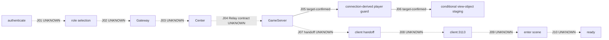

# BLIND W1 Journey Graph

This is a frozen, static-only projection of the requested business flow:
`authenticate -> role selection -> Gateway -> Center -> GameServer -> client handoff -> client:3113 -> enter scene -> ready`.

The machine-readable graph is [journey-graph.json](journey-graph.json). It is intentionally compact: target anchors are kept as identifiers, command lines, hashes, addresses/DIEs, and GraphEngine evidence IDs rather than copied raw dossiers.

## Provenance and anti-leakage

This artefact was built blind. It did not read Codex/Claude session logs, the prior `evidence/journey-graph/` artefact, W1 `WAVE-ATLAS.md`, `STATE.md`, cards, live-rootcause/fast-codec/session-derived material, or any of the held-out identifiers named in the task. No source-2010 or candidate source was used. The only inputs were `CLAUDE.md`, the W1-relevant roadmap outcome, GraphEngine target observations, target DWARF, and target disassembly.

`Gateway`, `Center`, the business-stage labels, and `client:3113` are contextual labels from the requested flow (with process context in `CLAUDE.md`). They are never promoted here to target-confirmed call or wire edges. The graph database and all three target binary hashes are pinned in JSON.

## Reading the graph

- Solid Mermaid arrows are only the two bounded, target-confirmed GameServer-local relations.
- Dashed arrows are `UNRESOLVED` / external-boundary context. They carry explicit gaps rather than invented payload or ordering semantics.
- `KPlayerServer::OnApplyCharacter` is a target-local observation at `SO3GameServerD@0x08061eb0`; it is not labelled as role selection, handoff, scene entry, or ready.

## Gaps and useful next slice

The graph does naturally isolate a useful but deliberately non-answering Relay slice: `Gateway -> Center -> GameServer` (J03/J04), followed by the target-local GameServer connection/player guard (J05). `KRelayClient` target DWARF proves that the GameServer owns a socket-stream and protocol-dispatch surface, while the selected handler proves nearby connection-to-player handling. Therefore a next evidence pass can narrowly search target-only Relay registration/handler closure immediately upstream of J05, then its target DWARF payload type and only then the Center counterpart.

It cannot yet localize a concrete contract: protocol identity, field layout/order, hash logic, section order, route, security state, scene transition, and ready acknowledgement remain unknown. No payload or hash logic is invented in this artefact.
