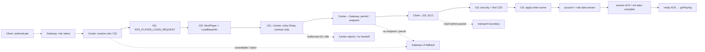

# W1 Journey Graph — prototype

This is a small, contract-aware projection of the W1 player journey.  It is
not a replacement target dossier and it does not change the active Wave
workflow.  Its job is to make a patch bundle answer one question: **which
business transition does this patch advance or repair?**

Canonical machine-readable projection: [`w1-enter-world.journey.json`](w1-enter-world.journey.json).
Raw GraphEngine query snapshots are in `raw/`; each target claim remains
reopenable through the linked W1 evidence rather than through this diagram.

## The journey



## Why this exposes what Atlas missed

`WAVE-ATLAS.md` correctly identifies “Relay role envelope” as a subsystem,
but its edge ends at `Center login envelope → OnPlayerLoginRequest`.  It does
not retain the **outbound entry Relay contracts emitted immediately after that
handler**.  The `841bbc…a2e2` session proved that this strip has at least these
patch-relevant contracts:

| Session patch family | Journey location | Contract consequence |
|---|---|---|
| Change-role-level `55 → 59` | GS↔Center entry strip | A 7-byte payload tagged with target ID 55 is rejected because target ID 55 has a different 14-byte contract. |
| Missing enum member + confirm ABI | Same strip | The entry enum prefix drifts; confirm-login must include `dwIP` in a 10-byte target payload. |
| `roleID` / `gatewayPlayerIndex` order | Center→GS login, then GS→Center/Gateway permit | Reversing `+2` and `+6` directs ext-point/permit work at the wrong Gateway client and prevents `:3113` handoff. |

These are a **single journey slice** even though they touch several structs and
files.  A hybrid workflow may therefore batch them only after the strip has a
table of target ID, size, fields, producer, consumer and candidate value.  It
must not use the graph to justify unrelated downstream role-load/ready patches.

## What is deliberately UNKNOWN

- exact target password hashing and Gateway account-validation logic;
- full GameCenter GS-selection/status branches;
- first decoded GS client protocol and its route into `OnApplyEnterScene`;
- stock runtime packet order/payload content after role data begins;
- whether the active `w1_level59` binary contains each historical session patch.

Unknown is first-class: no edge is promoted merely because source 2010 has a
plausible handler name.

## How S4 probe attaches without becoming paperwork

The probe emits an event such as `N04`, `N07`, or `N08` plus timestamp,
direction, protocol/length/payload hash where available.  It then reports:

```text
shared:     N03 Center receives selected role
divergent:  N06 GS→Center entry Relay contract strip
absent:     N08 client→GS SYN
next slice: N06 → N07 (Relay entry contract strip)
```

This replaces manual Card/STATE status propagation for experimental runs. A
future accepted patch still needs its normal raw diff, build, review and
runtime evidence; this projection only supplies the common map and a stable
place for multi-file, evidence-backed patch bundles.

## Assessment

Use this to **augment then replace the execution portion of Atlas**, not to
replace DWARF/Ghidra dossiers.  It is viable only if an exporter can refresh
the JSON from GraphEngine observations plus a small human-reviewed contract
strip. The test for usefulness is concrete: after adding the three session
patch families above, the graph must locate each in `N04–N07` without adding a
new card or a narrative dossier. It does so here.  The next iteration should
generate `N03–N08` probe events before attempting a complete login-to-scene
map.
